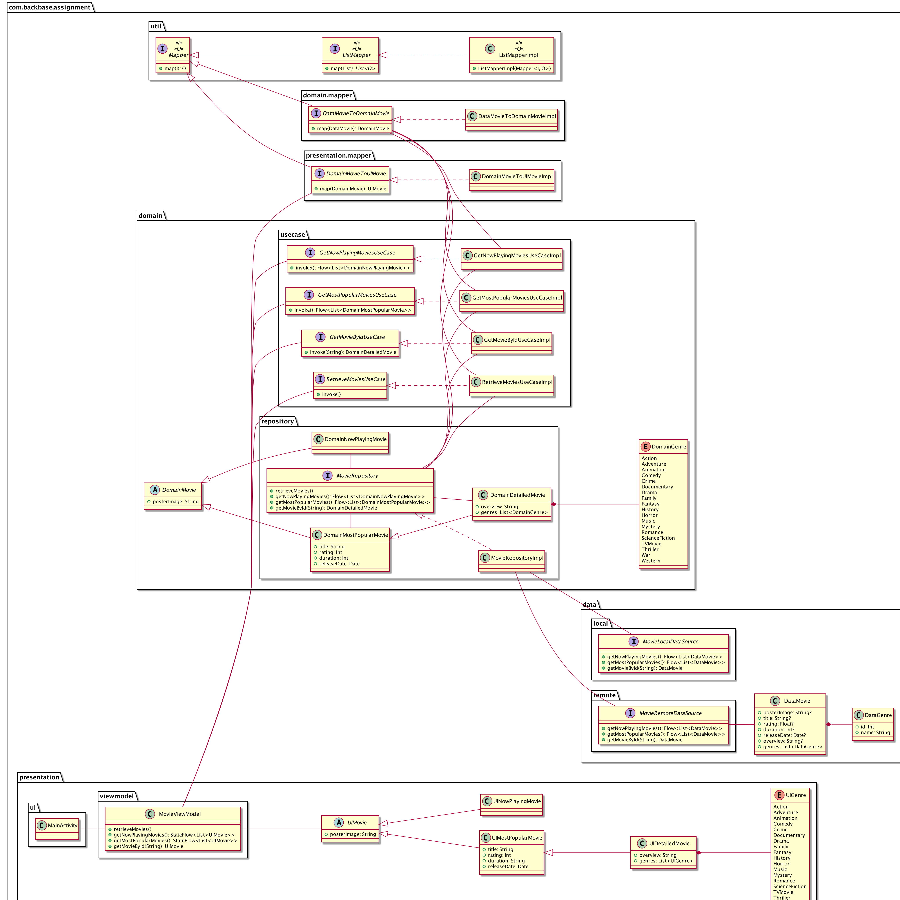

# MovieApp

## Architecture

The app is created with a clean architecture approach. The main layers are Presentation, Domain and Data.



### Presentation

This layer represent the user interaction with the app. The UI is render using the data from the 
ViewModel the persist the state of the app. The Presentation layer communicates with the Domain layers 
through the Use cases exposes from the Domain layer.

### Domain

Every user intention is represented inside this layer. The business logic is intended to be here. Using
the Use cases, the app send the information from the remote to the local data source using a repository
pattern.

### Data

The Data layer handle every data source. In this app there are two data sources: SQLDelight and Ktor.

#### SQLDelight

It is a library that handle the SQLite database creating an interface to easy adaption to the app. 
The main advantage of this library is that it could be used in multiplatform projects.

#### Ktor

Ktor works as a HTTP client. The library is adapted to kotlin and it could be used in multiplatform
projects as well.

### Presentation pattern

This app use ViewModel to handle the data persistence between the whole app lifecycle.

### Dependency Injection

In order to provide a better testing, every dependency is very well defined. Dagger is used to handle
the pre-compilation dependency injection.

### Repository pattern

The data persistence is handle by the repository pattern. Each time the user request for any data,
the Repository retrieve the data from the remote data source and save it into the local data source.
The local data source is used to provide the data to the user. The remote data source is used only in
case the user has internet connection.

### Mapper pattern

Every layer handle its own data model. It means, that the layers does not share models. the Mapper 
pattern is used to allow the architecture to share data between layers.

It is important to mention that lowers layers does not know about highers ones. It means that there
Domain layer does not communicate with the Presentation layer, but the Presentation does communicate
with the Domain. The same applies between The Domain and the Data.
 
Finally, every time the Presentation layer needs data to render the UI, it will request it to the 
Domain layer and the Domain layer will request it to the Data layer.

## Development process

TDD (Test Driven Development) was used in each feature of this app.

For testing purpose, this project implements [Mockk.io](https://mockk.io/) that is adapted to kotlin.

Each Test has the next structure:
```kotlin
fun someFunctionShouldCallAnotherFunctionOnSomeClassGivenThisFunctionOnSomeDependencyObjectReturnsRandomValue() {
    // Given
    val randomValue = Random.nextValue()
    every { someDependency.thisFunction() } returns randomValue

    // When
    objectToBeTested.someFunction()

    // Then
    verify { someClass.anotherFunction() }
}
```

Describing the name of the test you will see next elements:
- When section: Represents the function or event you are testing. Each test start with this section following a human description.
- Then section: Represents the assert of the test. The validation is described as `should call` or `should return`, explaining what should occur after when is occurs.
- Given section: Represents the preconditions or inputs of the test. Similar to `before each test`, but this section is only what this test should set up before when occurs.

Example:
```kotlin
fun whenThenGiven() {
    // Given
    // When
    // Then
}
```

## Development Lifecycle

1. Design Review.
2. Skeleton Classes.
3. UI Tests with mock ViewModels.
4. ViewModel unit tests with mock dependencies.
5. UseCase unit tests with mock dependencies.
6. Repository unit tests with mock dependencies.
7. LocalDataSource instrumented tests with no mock.
8. RemoteDataSource mock server tests.
9. Mapper unit tests. Each layer could contain mappers.
10. Instrumented tests per use case with no mock dependencies.

## Test lifecycle

1. Write a test that fail.
2. Write the minimum code needed to pass the test.
3. Refactor your test and/or your implementation following code best practices.
4. Write next test that fail.
 
NOTE: It is intended to see that the test is failing before the implemented is coded. So that, you
are sure the test is validating what you are expecting.
NOTE: You need to ensure that you don't write more test than needed in each step.

## Libraries

- Dagger: Dependency Injection.
- SQLDelight: SQLite database.
- Ktor: HTTP client.
- kotlin.plugin.serialization: Kotlin specialized serialization.
- ViewBinding: A view finding.
- Lifecycle: ViewModel and Lifecycle extensions.
- RecyclerView: An Android list view.
- JUnit: Unit test.
- Androidx.test: A set of libraries to test in Android platform.
- Mockk: Test double specialized on Kotlin.
- Coroutines: Multi-threading.
- Fresco: Image loaded and cache.
- PlantUml: UML automated diagram creator.

## The movie DB

This app use The movie DB to display the data. The app is ready to be used. In case you would like to
change the API Key that is used to access the API, go to the MovieRemoteDataSourceImpl.
